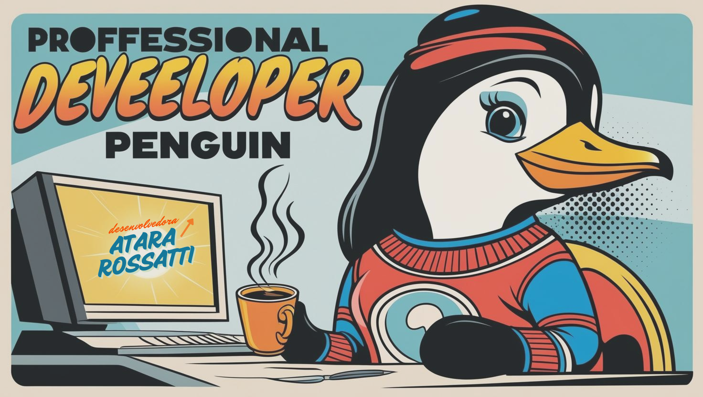

  

<h1 align="center">Olá 👋, sou Atara Rossatti</h1>
<h3 align="center">Sou Desenvolvedora Full-Stack e Designer UX/UI</h3>

    
    🏅 Participe do Hackathon Anatel <a href="https://g1.globo.com/sp/sao-paulo/noticia/2024/09/29/apos-promover-desafio-anatel-seleciona-3-melhores-solucoes-para-acabar-com-tv-boxes-ilegais.ghtml?kclid=P70KwpF6jI5KWOWW">TV Boxes ilegal</a> 
    📝 Participei do Hackathon Visite São Paulo <a href="https://www.linkedin.com/feed/update/urn:li:activity:7257178025828491265/">Aplicativo para Turismo em São Paulo</a> 
    📞 Você pode me contatar através do <a href="https://wa.me/+5511961187372">Telefone</a> 
    👨‍💻 Conheça minhas experiências <a href="https://www.linkedin.com/in/atarasilva/">LinkedIn</a> 
    📫 Ou me envie um e-mail para <b>atarasilva@hotmail.com</b>

    <!-- Adiciona três quebras de linha para aumentar o espaço -->

 

  
  
  
  
  
  
  
  

------
<h3 align="center">🏆Meus Emblemas</h3>

------

 
 

   
 
  
 
 
 ### - Languages and Tools...

  
      

##
 

  <a href="https://github.com/atararossatti">
  
  
  

##

  

 

  

  
  

